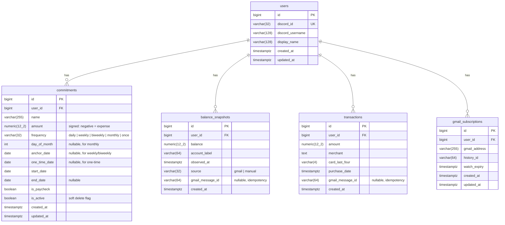

# Athena Database Schema

> Auto-maintained reference. Updated whenever migrations change the schema.

## Entity Relationship Diagram

## Tables

### `users`
Discord-authenticated application users.

| Column | Type | Constraints | Notes |
|--------|------|-------------|-------|
| `id` | `BIGSERIAL` | PK | |
| `discord_id` | `VARCHAR(32)` | UNIQUE, NOT NULL | Discord snowflake ID |
| `discord_username` | `VARCHAR(128)` | NOT NULL | |
| `display_name` | `VARCHAR(128)` | | Optional display name |
| `created_at` | `TIMESTAMPTZ` | NOT NULL, DEFAULT now() | |
| `updated_at` | `TIMESTAMPTZ` | NOT NULL, DEFAULT now() | |

**Indexes:** `idx_users_discord_id (discord_id)`

---

### `commitments`
Recurring expenses, income, and one-time payments. Uses signed amounts (negative = expense) and flat recurrence columns. The repository layer converts to/from the domain model's discriminated union.

| Column | Type | Constraints | Notes |
|--------|------|-------------|-------|
| `id` | `BIGSERIAL` | PK | |
| `user_id` | `BIGINT` | FK -> users.id, NOT NULL | |
| `name` | `VARCHAR(255)` | NOT NULL | |
| `amount` | `NUMERIC(12,2)` | NOT NULL | Signed: negative = outflow |
| `frequency` | `VARCHAR(32)` | NOT NULL | `daily`, `weekly`, `biweekly`, `monthly`, `once` |
| `day_of_month` | `INTEGER` | | For `monthly` frequency |
| `anchor_date` | `DATE` | | For `weekly`/`biweekly` cadence alignment |
| `one_time_date` | `DATE` | | For `once` frequency |
| `start_date` | `DATE` | NOT NULL | |
| `end_date` | `DATE` | | |
| `is_paycheck` | `BOOLEAN` | NOT NULL, DEFAULT false | Pay-period grouping flag |
| `is_active` | `BOOLEAN` | NOT NULL, DEFAULT true | Soft delete flag |
| `created_at` | `TIMESTAMPTZ` | NOT NULL, DEFAULT now() | |
| `updated_at` | `TIMESTAMPTZ` | NOT NULL, DEFAULT now() | |

**Indexes:** `idx_commitments_user_id (user_id)`, `idx_commitments_user_active (user_id, is_active)`

---

### `balance_snapshots`
Real-time balance observations from bank notification emails or manual entry.

| Column | Type | Constraints | Notes |
|--------|------|-------------|-------|
| `id` | `BIGSERIAL` | PK | |
| `user_id` | `BIGINT` | FK -> users.id, NOT NULL | |
| `balance` | `NUMERIC(12,2)` | NOT NULL | |
| `account_label` | `VARCHAR(64)` | | e.g. "Account - 1787" |
| `observed_at` | `TIMESTAMPTZ` | NOT NULL | When the bank reported the balance |
| `source` | `VARCHAR(32)` | NOT NULL, DEFAULT 'gmail' | `gmail` or `manual` |
| `gmail_message_id` | `VARCHAR(64)` | | For idempotent Gmail processing |
| `created_at` | `TIMESTAMPTZ` | NOT NULL, DEFAULT now() | |

**Indexes:** `idx_balance_user_time (user_id, observed_at DESC)`
**Constraints:** `UNIQUE (user_id, gmail_message_id)`

---

### `transactions`
Debit card usage notifications parsed from bank emails.

| Column | Type | Constraints | Notes |
|--------|------|-------------|-------|
| `id` | `BIGSERIAL` | PK | |
| `user_id` | `BIGINT` | FK -> users.id, NOT NULL | |
| `amount` | `NUMERIC(12,2)` | NOT NULL | |
| `merchant` | `TEXT` | | e.g. "PL*SENSEFLOWER -DAEJEON" |
| `card_last_four` | `VARCHAR(4)` | | |
| `purchase_date` | `TIMESTAMPTZ` | NOT NULL | |
| `gmail_message_id` | `VARCHAR(64)` | | For idempotent Gmail processing |
| `created_at` | `TIMESTAMPTZ` | NOT NULL, DEFAULT now() | |

**Indexes:** `idx_transactions_user_date (user_id, purchase_date DESC)`
**Constraints:** `UNIQUE (user_id, gmail_message_id)`

---

### `gmail_subscriptions`
Tracks Gmail Pub/Sub push notification watch state per user.

| Column | Type | Constraints | Notes |
|--------|------|-------------|-------|
| `id` | `BIGSERIAL` | PK | |
| `user_id` | `BIGINT` | FK -> users.id, NOT NULL | |
| `gmail_address` | `VARCHAR(255)` | NOT NULL | |
| `history_id` | `VARCHAR(64)` | | Last processed Gmail history ID |
| `watch_expiry` | `TIMESTAMPTZ` | | When the current watch expires |
| `created_at` | `TIMESTAMPTZ` | NOT NULL, DEFAULT now() | |
| `updated_at` | `TIMESTAMPTZ` | NOT NULL, DEFAULT now() | |

---

*Migration: `6c52f14865f5_initial_schema.py`*
