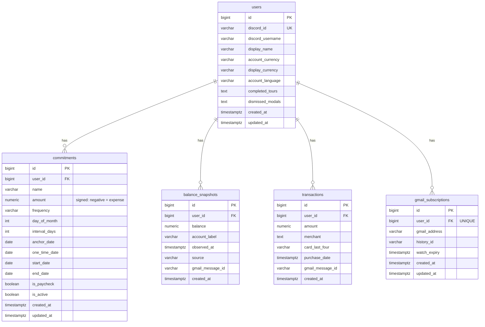

# Athena Database Schema

> Auto-maintained reference. Updated whenever migrations change the schema.

## Entity Relationship Diagram

## Tables

### `users`
Discord-authenticated application users.

| Column | Type | Constraints | Notes |
|--------|------|-------------|-------|
| `id` | `BIGSERIAL` | PK | |
| `discord_id` | `VARCHAR(32)` | UNIQUE, NOT NULL | Discord snowflake ID |
| `discord_username` | `VARCHAR(128)` | NOT NULL | |
| `display_name` | `VARCHAR(128)` | | Optional display name |
| `account_currency` | `VARCHAR(3)` | | User's base currency (e.g. USD, KRW, JPY, EUR, GBP) |
| `display_currency` | `VARCHAR(3)` | | Active display currency, reset to account_currency each session |
| `account_language` | `VARCHAR(5)` | | UI locale (e.g. en_US, ko_KR), auto-set from currency default |
| `completed_tours` | `TEXT` | | JSON array of completed tour names |
| `dismissed_modals` | `TEXT` | | JSON array of permanently dismissed modal keys |
| `created_at` | `TIMESTAMPTZ` | NOT NULL, DEFAULT now() | |
| `updated_at` | `TIMESTAMPTZ` | NOT NULL, DEFAULT now() | |

**Indexes:** `idx_users_discord_id (discord_id)`

---

### `commitments`
Recurring expenses, income, and one-time payments. Uses signed amounts (negative = expense) and flat recurrence columns. The repository layer converts to/from the domain model's discriminated union.

| Column | Type | Constraints | Notes |
|--------|------|-------------|-------|
| `id` | `BIGSERIAL` | PK | |
| `user_id` | `BIGINT` | FK -> users.id (CASCADE), NOT NULL | |
| `name` | `VARCHAR(255)` | NOT NULL | |
| `amount` | `NUMERIC(12,2)` | NOT NULL | Signed: negative = outflow |
| `frequency` | `VARCHAR(32)` | NOT NULL | `weekly`, `biweekly`, `monthly`, `semi_monthly`, `quarterly`, `annual`, `every_n_days`, `once` |
| `day_of_month` | `INTEGER` | | For `monthly` frequency |
| `interval_days` | `INTEGER` | | Custom interval for `every_n_days` frequency |
| `anchor_date` | `DATE` | | For `weekly`/`biweekly` cadence alignment |
| `one_time_date` | `DATE` | | For `once` frequency |
| `start_date` | `DATE` | NOT NULL | |
| `end_date` | `DATE` | | |
| `is_paycheck` | `BOOLEAN` | NOT NULL, DEFAULT false | Pay-period grouping flag |
| `is_active` | `BOOLEAN` | NOT NULL, DEFAULT true | Soft delete flag |
| `created_at` | `TIMESTAMPTZ` | NOT NULL, DEFAULT now() | |
| `updated_at` | `TIMESTAMPTZ` | NOT NULL, DEFAULT now() | |

**Indexes:** `idx_commitments_user_id (user_id)`, `idx_commitments_user_active (user_id, is_active)`

---

### `balance_snapshots`
Real-time balance observations from bank notification emails or manual entry.

| Column | Type | Constraints | Notes |
|--------|------|-------------|-------|
| `id` | `BIGSERIAL` | PK | |
| `user_id` | `BIGINT` | FK -> users.id (CASCADE), NOT NULL | |
| `balance` | `NUMERIC(12,2)` | NOT NULL | |
| `account_label` | `VARCHAR(64)` | | e.g. "Account - 1787" |
| `observed_at` | `TIMESTAMPTZ` | NOT NULL | When the bank reported the balance |
| `source` | `VARCHAR(32)` | NOT NULL, DEFAULT 'gmail' | `gmail` or `manual` |
| `gmail_message_id` | `VARCHAR(64)` | | For idempotent Gmail processing |
| `created_at` | `TIMESTAMPTZ` | NOT NULL, DEFAULT now() | |

**Indexes:** `idx_balance_user_time (user_id, observed_at)`
**Constraints:** `UNIQUE (user_id, gmail_message_id)` -- NULLs are treated as distinct, allowing multiple manual entries.

---

### `transactions`
Debit card usage notifications parsed from bank emails.

| Column | Type | Constraints | Notes |
|--------|------|-------------|-------|
| `id` | `BIGSERIAL` | PK | |
| `user_id` | `BIGINT` | FK -> users.id (CASCADE), NOT NULL | |
| `amount` | `NUMERIC(12,2)` | NOT NULL | |
| `merchant` | `TEXT` | | e.g. "PL*SENSEFLOWER -DAEJEON" |
| `card_last_four` | `VARCHAR(4)` | | |
| `purchase_date` | `TIMESTAMPTZ` | NOT NULL | |
| `gmail_message_id` | `VARCHAR(64)` | | For idempotent Gmail processing |
| `created_at` | `TIMESTAMPTZ` | NOT NULL, DEFAULT now() | |

**Indexes:** `idx_transactions_user_date (user_id, purchase_date)`
**Constraints:** `UNIQUE (user_id, gmail_message_id)` -- NULLs are treated as distinct.

---

### `gmail_subscriptions`
Tracks Gmail Pub/Sub push notification watch state per user.

| Column | Type | Constraints | Notes |
|--------|------|-------------|-------|
| `id` | `BIGSERIAL` | PK | |
| `user_id` | `BIGINT` | FK -> users.id (CASCADE), UNIQUE, NOT NULL | One subscription per user |
| `gmail_address` | `VARCHAR(255)` | NOT NULL | |
| `history_id` | `VARCHAR(64)` | | Last processed Gmail history ID |
| `watch_expiry` | `TIMESTAMPTZ` | | When the current watch expires |
| `created_at` | `TIMESTAMPTZ` | NOT NULL, DEFAULT now() | |
| `updated_at` | `TIMESTAMPTZ` | NOT NULL, DEFAULT now() | |

---

## Migrations

| Revision | Description |
|----------|-------------|
| `6c52f14865f5` | Initial schema (users, commitments, balance_snapshots, transactions, gmail_subscriptions) |
| `a1b2c3d4e5f6` | Add cascade deletes and unique constraints |
| `b2c3d4e5f6a7` | Add interval_days column to commitments |
| `c3d4e5f6a7b8` | Add account_currency column to users |
| `d4e5f6a7b8c9` | Add tour_completed_at (later replaced) |
| `e5f6a7b8c9d0` | Replace tour_completed_at with completed_tours (JSON array) |
| `f6a7b8c9d0e1` | Add display_currency column to users |
| `a7b8c9d0e1f2` | Add dismissed_modals column to users |
| `b8c9d0e1f2a3` | Add account_language column to users |
